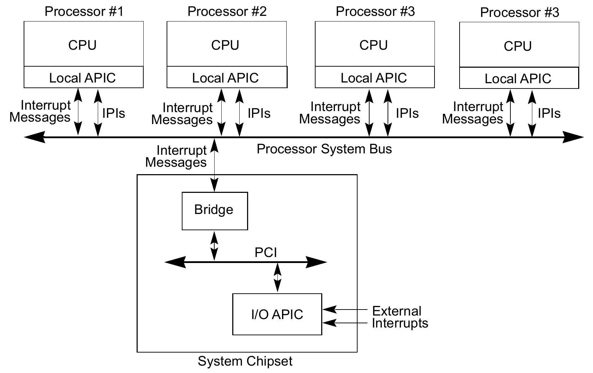

## Reading Intel SDM and other Specs

### APIC

- I/O APIC是在芯片组（chipset）里的（南桥？），虽然文档没有细说，但从图上看是经由PCI总线连接到一个bridge hardware上，后者通过cpu和chipset之间的信道（DMI总线？PCI？）把消息发到sys bus上。故此猜测，I/O APIC的中断到了Root Complex里也都变成MSI了，和PCI一样处理。

  

- APIC page
  - APIC page中的所有内存访问都会被APIC处理
  - APIC page的访问必须128bit对齐
  - 修改APIC_BASE_MSR中的对应域可以修改APIC page的base address
- x2APIC
  - 可以使用MSR来访问部分APIC寄存器

### User Interrupt（以下简称uIPI）

- 第四代至强新加入了用户态中断这一新特性，可以实现快速IPC，按照Intel的测试，普通经由kernel的IPC一般要几个微秒，而使用uIPI可以降低至几百纳秒
- CR4寄存器的25位用来做uIPI的使能标志位，UIF
- uIPI只能在64位模式使用，不能在SGX中使用
- 对UIRR（User Interrupt Request Register）的访问触发uIPI的识别，改寄存器通过MSR访问
- uIPI的权级比普通中断低一档
- 发生时，只会修改RIP和RSP，CPL保持=3（用户态）不变
- user interrupt posting基本过程
  - 用户态通过SENDUIPI指令发送uIPI，该指令使用参数index UITT这个表，UITT表的每一项是一个uIPI target，包含中断向量和UPID的地址
  - UPID中包含IPI的vector，目标CPU的ID，和PIR（是不是很像VMX里的Posted Interrupt Descriptor？）
  - 另一cpu的local apic接受到这个IPI，如果其中断向量为UINV寄存器的内容，判定为uIPI，否则视为普通中断，正常通过IDT deliver到kernel
  - cpu自动发送EOI通知LAPIC
  - cpu将UPID寄存器中的PIR更新到UIRR中
  - 上述UIRR的write动作出发了cpu对uIPI的处理（跳转到RIP）
  - UIRET指令——中断返回

### Machine Check Exception

- RAS系列blog

  - https://zhuanlan.zhihu.com/p/646145842

  - https://zhuanlan.zhihu.com/p/646144959

  - https://zhuanlan.zhihu.com/p/646146159

  - https://zhuanlan.zhihu.com/p/646147120

### System Management Mode

- 概述
  - 设计给firmware使用的，对于OS和app来说是透明的
  - 由System Management Interrupt（SMI）发起，cpu保存context，进入SMM
  - SMM的代码（SMI handler）在一个独立的物理地址空间SMRAM执行，其他软件不可访问
  - SMM中所有应该由OS处理的中断都被禁止
  - SMM代码处理完毕后，使用RSM指令返回正常状态
  - SMM使用real-address模式，paging关闭，所以SMM代码的地址空间是4G
- SMRAM
  - 进入SMM时自动切换到real mode，paging被关闭，只映射0-4G的物理地址空间
  - SMRAM默认是SMBASE到SMBASE+64K的一块内存
  - SMBASE在cpu reset之后是0x30000H
    - 这个值存放在SMBASE寄存器中
    - 如果state save area的SMM revision identifier field中的SMBASE relocation bit是1，则SMBASE可以在SMM模式下更改
    - 通过更改state save area的SMM base field，RSM的时候会读取这个field，写入SMBASE寄存器
    - firmware必须在系统初始化时依次设定每个logical processor的SMBASE值，不可重叠
  - SMI handler的code和data存放在SMRAM中，默认在SMBASE+32K的地方，这也是SMI发生后cpu跳转到的地方
  - SMI发生时的context被cpu保存在SMRAM的尾部
    - 对于不支持64位的cpu，开始于SMBASE+0xFE00H
    - 对于支持64位的cpu，开始于SMBASE+0xFC00H
    - 从SMBASE+0xFFFFH开始，倒着使用
  - SMRAM最大可以使用4G
  - SMRAM不仅可以在system memory里，也可以在单独的RAM芯片中，这个看具体硬件设计
- SMI
  - 最高权限的中断，不同于正常的中断处理流程
  - 不可重入，SMM下SMI是关闭的
  - SMI发生时
    - cpu会等待发射的所有指令retire，且所有store都结束
    - cpu会通过sys bus广播SMI已被接受的消息，进入SMM模式
    - SMM中产生的新的SMI会pending，但最多只pending一个
  - SMM退出时（RSM指令）
    - cpu在sys bus上发消息，退出SMM
- SMI handler
  - 进入SMM，寄存器被初始化到一个指定的状态
  - 可以打开paging，或者进入64位模式
- SMP
  - 任意一个core都可以响应SMI
  - 不同的core拥有各自的SMRAM区域，SMRAM可以重叠，但是state save area和data区域不得重叠，code和static data区域可以共用
- linux kernel
  - 可以使用SMI_COUNT MSR查看SMI的发生次数
  - 根据 Intel Chipset Family Platform Controller Hub（PCH），可以使用APM（Advanced Power Management）触发SMI。APM_CNT为I/O端口为0xB2的控制寄存器，向APM_CNT发出out指令可以产生SMI。

### Topology Enumeration

- System Topo and Unique APIC ID（Processor ID）
  - CPUID：0BH用于保持legacy的enumeration
  - CPUID：1FH包含更多信息，但需要使用新算法，新算法兼容legacy的0BH
    - 可以表示多种层级的topo（Package、Die、Module、Core、甚至Unknown Level）
  - 具体的算法感觉没啥意思，就是一些bit的各种表示和操作，没细看
- Cache Topo
  - CPUID：04H
- TLB Topo
  - CPUID：18H

### Refs

- Intel Software Developer Manual
- Intel 64 Architecture Processor Topology Enumeration
