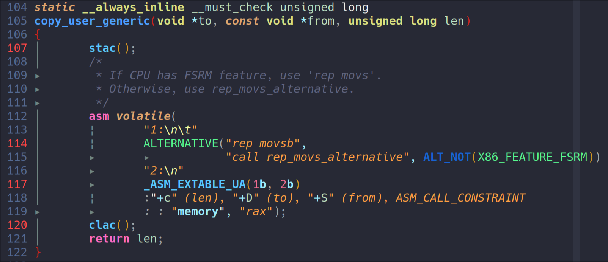

## Interrupt and Exception handling

### Kernel Exception Fixup

- kernel exception fixup

  - 举个栗子，kernel访问user space的时候，由于x86上k/u页表是合并的，可以直接去访问这个地址，但是如果page fault了，page fault handler会检查这个kernel访问的user地址在vma中是否存在，如果不存在，该怎么办？这时候相当于kernel code发生了exception，既然是exception，exception的这句指令就不能继续执行，而我们是在kernel code里，总要找个地方继续执行下去，这个地方就叫fixup address，我们可以把rip换成fixup的入口继续执行。

  - 那这个fixup address怎么设置？是通过exception fixup table注册的，page fault handler会去寻找这个table得到fixup address，把context的rip换成这个fixup address，再返回继续执行。

  - exception fixup table是位于内核的`__ex_table`段的一个“地址a到地址b”的索引表。如下图的例子，这段汇编通过`_ASM_EXTABLE_UA`来注册了一对索引：1b这个label的地址，map到2b这个label的地址。那么通过查找这个extable就可以得知1b地址的fixup address是2b。在这个例子中，fixup address就是fault地址的下一条指令，相当于跳过了fault的指令。

    

  - 在实际的extable中，fixup address用的都是相对与extable表头的相对地址

- vdso exception fixup

  - 这个就是用来解决用户态的exception fixup，如果kernel不能解决用户态的exception，将要发信号杀掉进程，那么可以回到用户态的fixup address来解决这个exception
  - vdso的extable也是类似的，只不过最终的vdso image并没有`__ex_table`段，它的fixup table被`vdso2c.c`这个程序从vdso image中strip出来，hardcode成`vdso-image-64.c`这段代码，放在text段。extable的地址也是hardcode的。
