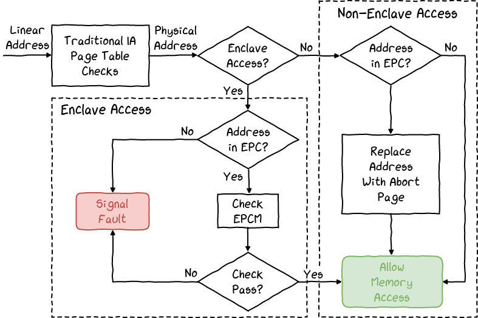

## Intel Software Guard eXtensions

### Memory

- Encryption

  - Keys are generated at boot-time and are stored within the CPU

- Enclave Page Cache

  - Init
    - Firmware configs EPC sections (physically contiguous pages)
      - max 8 sections in linux 6.1.7

    - Kernel gets these sections by CPUID, then allocates them by page

  - Enclave Page Cache Map
    - store EPC states

    - inside EPC

- Address Translation

  

### Enclave Life Cycle

- Creation

  | sgx driver inside kernel                   | user process                     | enclave |
  | ------------------------------------------ | -------------------------------- | ------- |
  |                                            | annonymous mmap分配一段内存      |         |
  |                                            | 打开sgx设备，ioctl(CREATE)       |         |
  | ECREATE                                    |                                  |         |
  |                                            | 通过ioctl把enclave每一页load进去 |         |
  | 分配EPC并copy每一页内容（EADD），并EEXTEND |                                  |         |
  |                                            | ioctl发起EINIT                   |         |
  | EINIT                                      |                                  |         |

- Runtime Modification

- Async Exit

- Attestation

- End of life

### References

- Intel SDM Volume 3d
- SGX Documentation, released with binaries
  - Developer Guide
  - Developer Reference
- Intel SGX Explained, from MIT
- https://blog.quarkslab.com/overview-of-intel-sgx-part-1-sgx-internals.html
- https://blog.quarkslab.com/overview-of-intel-sgx-part-2-sgx-externals.html
- Kernel source code: arch/x86/kernel/cpu/sgx