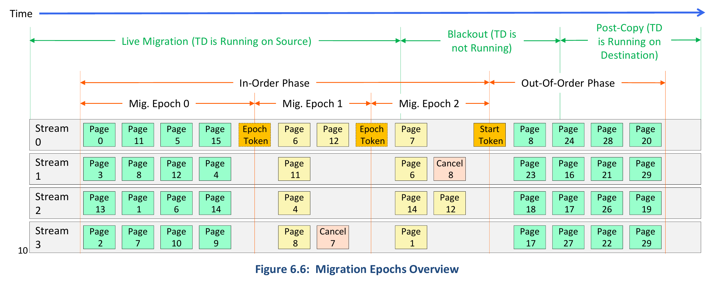

## TD Migration

1. Service TD
   - service TD分很多类型（SERVTD_TYPE），每一次binding对应一种type，如果一个service TD实现了多种type，要多次binding
     - 目前只有Migration TD
   - service TD可以读写target TD内存（`TDG.SERVTD.RD/WR`），具体权限取决于类型的service TD类型
   - 在target TD的Service TD Binding Table汇集了所有的service TD
     - `SERVTD_BINDING_STATE`，`SERVTD_INFO_HASH`，`SERVTD_TYPE`，`SERVTD_ATTR`
   - Binding
     - service TD和target TD是多对多的配对
     - service TD可以嵌套：一个service TD可以是另一个service TD的service TD
     - service TD的绑定无需经由target TD同意，也就是target TD无感，但是target TD的measurement中会包含service TD的digest
     - Class vs. Instance Binding
       - 目前只有Class Binding：只有`SERVTD_INFO_HASH`，`SERVTD_TYPE`，`SERVTD_ATTR`相等才可以做rebind
     - Migratable vs. Non-migratable Binding
       - 目前只有Non-migratable Binding：`SERVTD_BINDING_STATE`，`SERVTD_TYPE`和`SERVTD_ATTR`在迁移时会作为immutable state迁移走，但是接收端只做检查，会用接收端的service TD计算新的值
   - SERVTD_HASH及其计算
     - 发生在两个时间点：`TDH.MR.FINALIZE`和`TDH.IMPORT.STATE.IMMUTABLE`（也就是说迁移后会重新计算）
     - 一个target TD的SERVTD_HASH是其TDCS中Service TD Binding Table的SHA384，其中表项按照某种既定顺序排序

2. Migration Data and Format

   - 主要包含三种
     - Immutable Non-Memory State
       - TDX module global、TDR、TDCS：`TDH.EXPORT/IMPORT.STATE.IMMUTABLE`
     - Mutable Non-Memory State
       - TDCS：`TDH.EXPORT/IMPORT.STATE.TD`
       - TDVPS：`TDH.EXPORT/IMPORT.STATE.VP`
     - Memory State
       - TD private pages、Secure EPT：`TDH.EXPORT/IMPORT.MEM`
   - Shared Memory和Shared Non-Memory State由VMM负责迁移

   - 迁移的数据由一个个Migration Bundle组成，包含一个Metadata（MBMD）和Data部分
     - MBMD包含一些描述信息，和MBMD+Data的MAC
     - Data部分由多个4K页或者一个2M页组成，用一个HPA list描述，由TDX Module生成的Encryption Key加密（AES-256-GCM）
     - 注意：迁移private memory是按照4KB粒度的，所以迁移之前所有大页必须break down成小页
   - Non-Memory State在Data页的格式和Metadata Field Encoding是一样的，一个页包含一个Metadata List，一个List由Sequence Header和多个Sequence组成
   - 只有用到的Non-Memory State才会迁移，因TD配置而不启用的state、reserved区域等是不会迁移的

3. Migration Phase、Migration Stream和Migration Ordering

   - Stream是TDX Module的概念，Queue是VMM的概念，一个Queue可以传多个Stream

   - Export主要分In-Order和Out-Of-Order两个阶段，前者对应Live Migration，后者对应Cold Migration

     - VMM可以进行Cold Migration，即没有In-Order阶段；也可以在Live Migration全部迁移完毕

   - 在In-Order阶段，一个Stream中的export和import是必须串行化的，也就是import顺序必须和export顺序相同

   - In-Order阶段迁移过的页在此阶段结束前必须迁移为最新版本，即最新版本的import必须在Out-Of-Order阶段开始之前完成

   - In-Order阶段分成很多epoch，同一个页在一个epoch里边只能迁移一次

   - Out-Of-Order阶段不分epoch，Stream中不要求顺序

   - Non-Memory State只能迁移一次，有一些顺序规则（比如TDCS必须先于TDVPS），是由TDX Module的状态机保证的

   - source到destination有多个Stream，destination到source只有一个Stream（用来发送Abort）

     

4. TD Migration Life Cycle
   - A. Pre-Migration
     - VMM读取TDX Module支持的TD migration capabilities和service TD capabilities
     - 两端VMM启动MigTD，MigTD读取TDX平台信息，把migration policy反映到RTMR中
   - B. Reservation and Session Setup
     - VMM启动source TD，其中ATTRIBUTES.MIGRATABLE为1，给source TD绑定MigTD
     - VMM构建destination TD，直到`TDH.MNG.ADDCX`完成TDCS的初始化，在`TDH.MNG.INIT`之前给destination TD绑定MigTD
     - 两端VMM做`TDH.MR.FINALIZE`完成MigTD构建
     - VMM为MigTD建立一个通信信道，MigTD互相做RA（`TDH.MR.REPORT`+生成Quote+验证对方Quote），产生transport key用于加密信道（Diffie-Hellman exchange）
     - source MigTD检查对端Migration Policy是否满足迁移要求
     - Migration密钥协商（AES-256-GCM）
       - source MigTD通过`TDG.SERVTD.RD`读取migration encryption key发送给destination MigTD
       - destination MigTD通过`TDG.SERVTD.WR`给TDX Module注入migration decryption key
       - 反之同理，destination MigTD读取migration encryption key，source MigTD注入migration decryption key
       - 每次读取migration encryption key、`TDH.MNG.CREATE`、或`TDH.*PORT.STATE.IMMUTABLE`时，TDX Module都会生成一个新的key
   - C. In-Order Memory Migration
     - 迁移Immutable Non-Memory State：`TDH.EXPORT/IMPORT.STATE.IMMUTABLE`，标志In-Order阶段开启
     - 开始一个migration epoch（Memory Pre-Copy）
     - `TDH.EXPORT.BLOCKW`禁止此epoch迁移的内存page以及对应SEPT entry的write operaion
     - 为此epoch迁移的地址做TLB shootdown：`TDH.MEM.TRACK`，给所有vcpu打IPI引起re-enter
     - `TDH.EXPORT.TRACK(epoch token)`创建此epoch的token
     - 迁移内存：`TDH.EXPORT/IMPORT.MEM`，destination端建立SEPT`TDH.MEM.SEPT.ADD`，SEPT是不直接迁移过去的
     - `TDH.IMPORT.TRACK(epoch token)`接收此epoch的token
     - 此migration epoch结束，开始下一个epoch
     - In-Order阶段脏页追踪：已经export的页是被block的，如果TD去写，会EPT Violation，这时需要VMM接触写限制`TDH.EXPORT.UNBLOCKW`，TDX Module会给这一页标脏。TDCS里的dirty count记录脏页数量，保证VMM export了所有脏页
     - In-Order阶段所有epoch结束后，暂停TD（`TDH.EXPORT.PAUSE`），迁移剩下的Non-Memory State，TD进入blacked out phase
     - 迁移Mutable Non-Memory State：`TDH.EXPORT/IMPORT.STATE.TD/VP`
       - destination端在IMPORT VP之前要创建好vcpu： `TDH.VP.CREATE/ADDCX`
     - `TDH.EXPORT.TRACK(start token)`，TD退出blacked out phase，TDX Module基于MSK生成一个带MAC的start token
       - 这代表Memory Pre-Copy、Mutable Non-Memory State的迁移都结束了，开启Out-of-Order Memory Migration
     - `TDH.IMPORT.TRACK(start token)`，TDX Module接收start token，destination TD有此start token才能运行。start token的MBMD中的TOTAL_MB确保了destination端import了所有MB。
   - D. Out-of-Order Memory Migration
     - 迁移所有In-Order阶段没有迁移的内存，不在意顺序；可以重复export/import同一个页，但多余的import会被丢弃，因为这时候这个页肯定不是脏页（因为TD已经停止运行）
     - source VMM通知destination VMM迁移结束，destination端做`TDH.IMPORT.COMMIT`，此后新的TD可以运行，source TD不能再运行
     - Memory Post-Copy：VMM的迁移策略可能需要在TD运行起来之后才按需迁移最后一部分内存，也就是TD访问缺页时才迁移
     - destination端做`TDH.IMPORT.END`，迁移结束，source VMM清理source TD资源
   - E. Aborted Private Memory Migration
     - source端错误且迁移错误产生在start token生成之前，source VMM可以直接`TDH.EXPORT.ABORT`，不需要abort token，直接通知destination VMM销毁TD即可
     - destination端错误，或者迁移错误产生在start token生成之后，destination VMM做`TDH.IMPORT.ABORT`生成一个abort token，source VMM用这个abort token做` TDH.EXPORT.ABORT`，让source TD变得runnable，并重置SEPT：`TDH.EXPORT.RESTORE`
     - `TDH.IMPORT.END`之后不能再Abort
   - 一些特殊情况
     - In-Order阶段不允许进行内存动态管理，如增加/删除，拆分/组装，重分配，BLOCK/UNBLOCK
     - Out-of-Order阶段的内存动态管理
       - 允许拆分/组装，重分配
       - 允许增加内存（`TDH.MEM.PAGE.AUG`），但这时增加内存很可能是恶意的：VMM可以先删除这一页在增加这一页内存，所以这时TD不应该Accept
       - 允许删除内存，但是会把SEPT entry状态标为REMOVED而不是FREE，这是为了防止VMM进行重放攻击：VMM做了import，TD可能修改了这一页，然后VMM删除这一页，重新做一遍import，状态机阻止了这种re-import
     - IMPORT会记录epoch值，在下一次re-import或者import cancel的时候会检查记录的epoch值必须是一个旧的值，保证顺序
     - 如果因为TDX Module返回的错误或者VMM自身原因需要撤回一个已经迁移的页，可以使用带有CANCEL flag的`TDH.EXPORT.MEM`，会产生一个带有CANCEL语义的MB并恢复SEPT到之前的状态，对端IMPORT时候则会删除这一页
     - VMM并不知道TD是否Accept了一个页，如果export了一个还没有被TD Accept的页（PENDING状态），MB里边不会有buffer，只有属性，对端会import成一个PENDING的页。如果TD对一个已经EXPORT的页做了Accept操作，会产生EPT Violation，相当于对这一页做写操作，VMM做UNBLOCKW，TDX Module标脏，然后TD重新Accept，变成一个脏页
     - In-Place Import：直接把MB里边的buffer变成TD内存，这样可以减少destination VMM的buffer消耗，TDX Module只需要一个自己栈内存的fixed-size buffer完成In-Place Decryption即可，但是不能用于re-import。使用In-Place Import的方法是在`TDH.IMPORT.MEM`的PAGE_LIST参数里，把对应entry承担INVALID bit置位，或者PAGE_LIST设为NULL_PA（全1地址）
   
5. Control Structures Additions for TD Migration

   - 所有TD-Scope的Migration Metadata都在TDCS中
   - SEPT多了一些bit来表示迁移状态
     - Host-Side Entry Lock bit，在并发迁移SEPT的时候避免直接lock掉整个SEPT
   - Migration Stream Context（MIGSC）：记录Migration Stream的Metadata，是TDX Module内部结构，与VMM和TD无关

6. Migration TD Design

   - **TODO**
