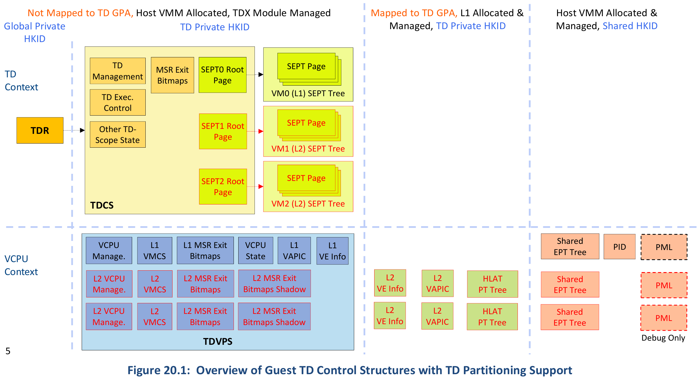
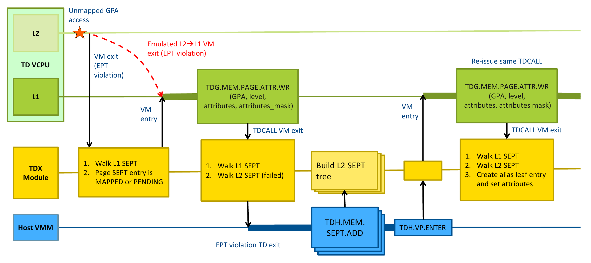
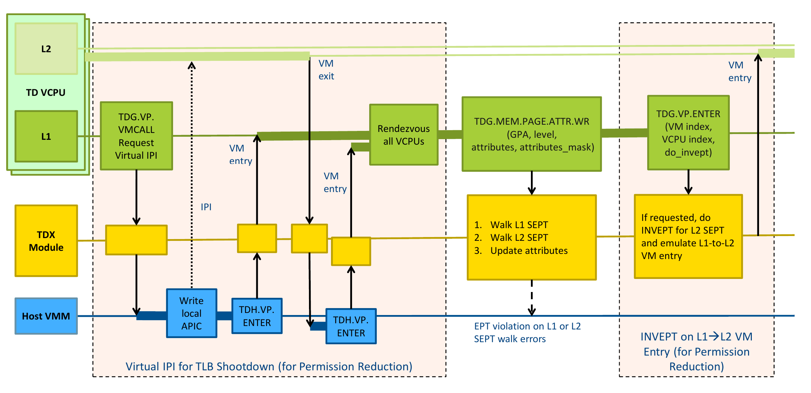
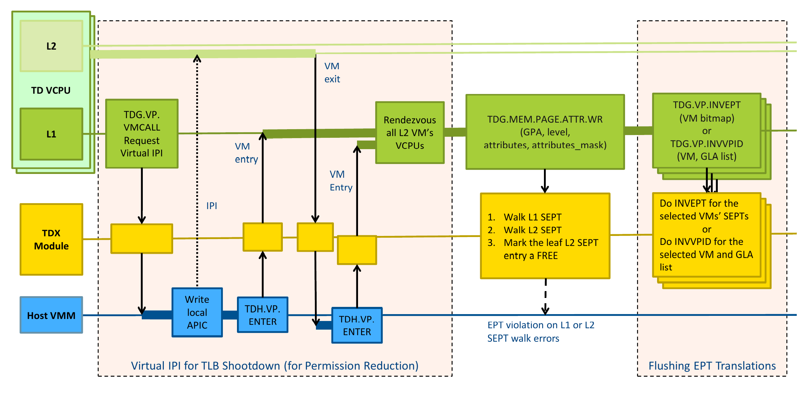
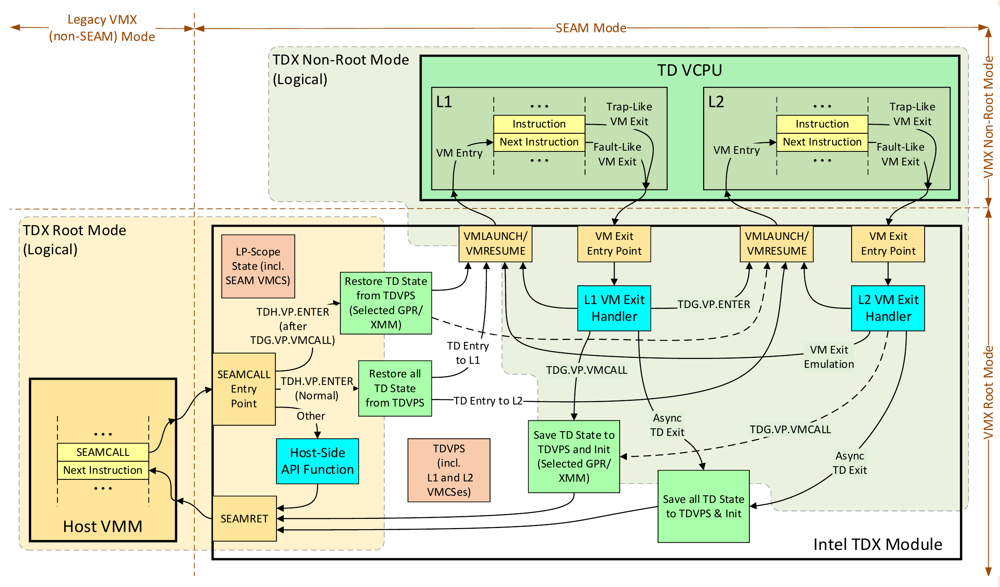
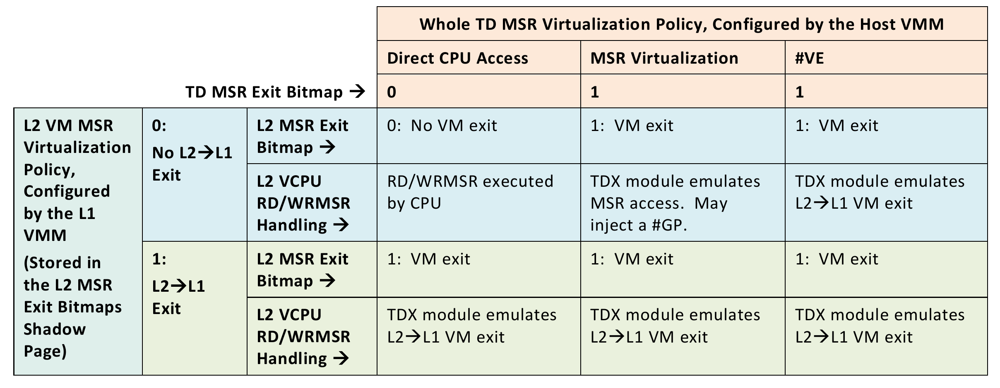

## TD Partitioning

#### Overview

- 嵌套虚拟化（Nested VMX）的基本原理：Host对L1执行的虚拟化指令的模拟

  - L1执行的VMLAUNCH会Exit，Host根据VMCS12构造VMCS02，把当前vcpu的VMCS由VMCS01切换成VMCS02，运行L2 VM，即L1和L2都是由Host直接运行的。
  - L2 Exit时Host把VMCS切换回VMCS01，回到L1，L1处理L2 Exit

- TD Partitioning类似于Nested VMX，但不同：

  - L1和所有L2共享GPA空间，但是同一个页在不同Partitioned TD中的属性（RWX等）可以不同，这个叫page alias
  - L1 to L2 entry、L2 Exit都是经由TDX Module（`TDG.VP.ENTER`），L1是不能执行VM系列指令的
  - L2 Exit可以回到L1或者Host，当然也是经过TDX Module
  - Host/TDX Module可以在L2 Exit之后直接resume L2，也可以resume L1

- 其他基本情况
  - 一个TD里边最多跑4个Partitioned TD，包括一个L1 VMM（VM0）和3个L2 TD，这里边只有两个L2 TD（VM1、VM2）是TDX-aware的，VM3被视为普通L2 Guest（legacy guest）
  - L1是L2的TCB，L1自己要保护好自己不受L2的攻击
  - Migration对Partitioned TD有支持
  - RA是L1的事情，L2不管

#### L2 Non-Memory States

- TDCS中新增了VM1和VM2的SEPT
- TDVPS中新增了VM1和VM2的vcpu metadata，包括VMCS、MSR Bitmap等
- VM0需要记录和管理VM1和VM2的VE Info  page、vAPIC page等，L1可以把VE Info map到L2中去
- Host需要新增VM1和VM2的Shared EPT

#### L2 Memory Management

- L1/L2 SEPT

  - L2 SEPT page是Host分配的（`TDH.MEM.SEPT.ADD`），不是L1
    - Host可以依次分配好所有的L2 SEPT page，也可以动态按需分配
  - L2的private memory一定要map在L1的SEPT中，GPA和HPA相同，但是属性可以不同，这叫page alias
  - L1和L2的SEPT的级数必须是相同的
  - 对private memory进行操作的TDX Module API会同时对L1和L2的SEPT进行操作（如果该页page alias到某个L2）
  - L1可以不给L2开EPT，如果是legacy guest，也可以不开shared EPT（即对于L2，透明地运行在SEPT上）

- L1对L2内存的管理（page alias）

  - L2内存的动态添加：`TDG.MEM.PAGE.ATTR.RD/WR`

    

    - 页的粒度（大页/小页）和Host分配的保持一致，这个类似于page accept的情况
    - L1 accept内存的时候同时也accept了其对L2的page alias
    - 当然，Host也可以选择让L2一开始就有跟L1一样的SEPT

  - L2内存的动态修改（一般指属性，比如权限）：`TDG.MEM.PAGE.ATTR.RD/WR`

    

    - L1在修改完毕之后，要按需对L2做INVEPT：通过`TDG.VP.ENTER`的一个参数控制

  - L2内存的删除：`TDG.MEM.PAGE.ATTR.RD/WR`

    

    - L1在删除完毕之后，要为L2做TLB shootdown：`TDG.VP.INVEPT`或者`TDG.VP.INVGLA`，后者其实是在做INVVPID type 0

#### L2 VCPU

- L2 VMCS

  - L2通过`TDG.VP.RD/WR` 读写L2 VMCS
  - L1对VMCS的操作都是用的GPA，但是VMCS里边必定是HPA，所以这中间TDX Module会做一些转换

- L2 VCPU Enter

  - L2的状态对L1是开放的，所以需要L1记录VMCS不负责恢复的vcpu state，在`TDG.VP.ENTER`时提供L2_ENTER_GUEST_STATE，L2 Exit的时候L2_ENTER_GUEST_STATE会被TDX Module更新，并在GPR中提供exit qualification
  - L2默认不能做TDVMCALL，L1可以选择性地为L2开启这个功能，但是无法控制L2怎么使用TDVMCALL，故开启之前需要确保L2能够正确handle Host对TDVMCALL的回复（可能是恶意的）
  - L2 VCPU初始状态
    - 是由L1决定的，L1要把初态写入VMCS
    - 不再像L1一样有限制，可以使用实模式

- L2 Exit有一下几种情况：

  - **L2 -> TDX Module -> L2**：TDX Module可以handle的Exit，比如L2做WRMSR，需要注入#GP(0)
  - **L2 -> TDX Module -> L1**：需要L1处理的Exit，比如CPUID模拟，Posted Interrupt handling
  - **L2 -> TDX Module -> Host -> L2**：需要Host来handle，比如收到了NMI
  - **L2 -> TDX Module -> Host -> L1**：需要Host来handle，且Host要求先回到L1 handle，比如L1给L2打IPI从而做TLB shootdown或者L2做TDVMCALL需要L1解决
    - L2做了TDVMCALL到Host，但是当Host选择返回L1时，L1可以通过`TDG.VP.ENTER`的状态码得知是从Host来而不是从L2直接Exit到L1，同时L2的vcpu state反应的是TDVMCALL返回之后的vcpu状态，而不是L2做TDVMCALL时的状态

- L2 vAPIC

  - vAPIC page是L1通过写VMCS（`TDG.VP.WR`）分配的，所以L1可以自由访问；当然，它必须是private memory
  - L2的APIC是以x2APIC的模式模拟的
  - L2 Posted Interrupt Processing
    - PI只能发生在L1，即L2 VMCS是关闭PI的，且不可被L1配置
    - 如果打PI时VCPU在L1，那就是正常的PI Delivery，不会Exit
    - 如果打PI时VCPU在L2，PI的Notification Vector会被cpu认为是普通中断，发生L2 Exit，TDX Module发现是NV，则注入PI到L1
    - `TDG.VP.ENTER`的时候，如果TDX Module查看PID的ON bit发现有pending PI，那回绝这次vcpu enter，回到L1先处理PI

- L2 MSR、CPUID、CR

  - CPUID、MSR、CR4完全由L1模拟，当然是在Host暴露给L1的CPU features的基础上；TDX Module对CPU features的限制（即指令的限制）是针对整个TD的，不区分L1和L2

  - CPUID一定导致L2 Exit，L1可以直接模拟返回值，也可以执行该CPUID，让Host模拟

  - MSR bitmap需要通过`TDG.VP.RD/WR` 读写

  - 对L2 MSR的配置是对L1的配置（MSR bitmap）和整个TD的配置的combination。具体看下图：

    

#### L2 Debug

- **On-L2 Debug**：CPU的debug特性基本上都可以用，由L1控制（前提是Host给L1开了这个特性）
- **L1 Debug of L2**：L1是L2的TCB成员，所以可以用VMX debug features，只要Host给L1开了这些特性；此外，L1可以查看一些L2 VMCS的内容
- **Off-TD Debug**：自然延伸至L2，Host可以看L2 private memory