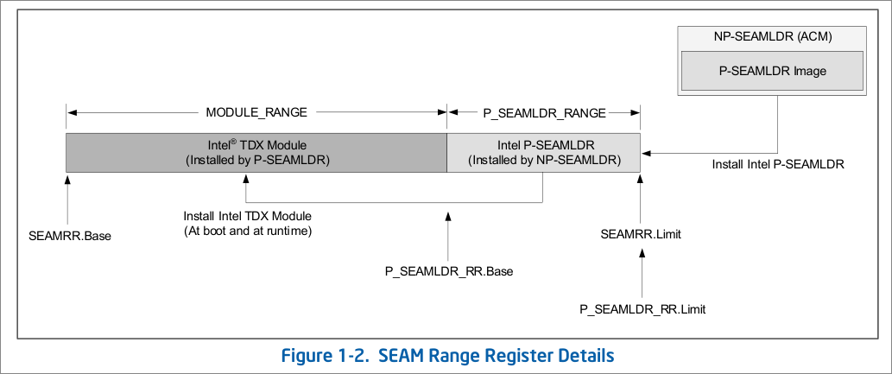

## Intel Trusted Domain eXtension

#### 先来张图压压惊

#### TDX Hardware Extensions

1. SEAM（SEcure Arbitration Mode）mode：VMX的扩展

   - SEAM VMX root（Intel TDX Module和P-SEAMLDR）和SEAM VMX non-root（TD guest）

2. 一对SEAMRR寄存器在内存中划出一段保留区域，给TDX module和P-SEAMLDR使用
   

3. 新指令

   - SEAMCALL：用于VMM调用TDX module的功能（TDH leaf）

   - SEAMRET：用于从TDX module返回VMM（从SEAMCALL中返回）

   - SEAMOPS：用于TDX module操作TDX硬件

   - TDCALL：用于guest请求TDX module或VMM的服务（TDG leaf）

   - VMRESUME/VMLAUNCH：相比普通VMX，行为上有修改（比如必须启用EPT），用于TDX module运行guest

4. VMCS里的新东西

     - Shared EPTP

     - TD HKID

     - GPAW execution control

#### 内存加密

1. TME-MK（Total Memory Encrytion - Multi Key）

   - 加密算法：AES-XTS-128；密钥由CPU硬件随机数产生，软件不可见；物理地址会参与到加密过程（XTS模式），所以同key同内容的page加密结果不一样。
     - 完整性保护
       - crypto mode：SHA3-256 truncated to 28bit；每个cacheline有一个1bit的TD ownership
       - logical mode：只有一个bit表示TD ownership
       - 这些额外的bit应该是在ECC内存的校验码区域

   - 计算MAC的input包含：
     - 一个cacheline：64B
     - 128bit AES key：使用HKID key加密物理地址得到（HKID key是KDK（Key Derivation Key））
     - TD ownership bit
     - 128bit MAC key：硬件生成

   - 四种模式
     - 软件指定key
     - 硬件生成key
     - 使用legacy TME 平台的key（KeyID == 0）
     - 不加密

   - 配置
     - BIOS在启动早期使能，一旦使能不可关闭
     - 使用PCONFIG指令，PCONFIG目前就这一个leaf，配置是per package的
     - MSR：`IA32_TME_*`

2. Host Key ID（HKID）

   - 非TDX情况下是PA（HPA）的upper bits（包括VMCS地址，EPTP，EPT各级页表地址等等）
     - TDX把HKID空间分成了三个range

       - 0：Legacy TME key
       - 1 ～ NUM_HKID_KEYS：shared
       - `NUM_HKID_KEYS+1` ～ `NUM_HKID_KEYS+NUM_TDX_PRIV_KIDS`：TDX private
       - `NUM_HKID_KEYS`、`NUM_TDX_PRIV_KIDS`这两个数通过MSR `IA32_MKTME_KEYID_PARTITIONING`得到

      - Host kernel负责HKID的分配和回收

      - Shared HKID：HKID是HPA的upper bits，PCONFIG指令配置

        

      - Private HKID：host kernel通过`TDH.MNG.KEY.*`配置HKID，TDX module在修改SEPT的时候吧HKID加到HPA的upper bit上

        - `TDH.MNG.CREATE`给TD分配HKID
        - `TDH.MNG.KEY.CONFIG`告知TDX module操作硬件给TD配置key

      - 回收HKID
        - 保证不在执行任何vcpu相关的SEAMCALL，且目标TD所有vcpu不在运行
        - `TDH.VP.FLUSH` `TDH.MNG.VPFLUSHDONE` flush VMCS和TD的ASID范围的TLB
        - `TDH.PHYMEM.CACHE.WB` flush cache（相当于WBNOINVD指令）
        - `TDH.MNG.KEY.FREEID`释放HKID

3. 内存加密相关的三张表

   - Key Encryption Table（KET）：包含KeyID，key，加密模式，这个是TME-MK管理

   - KeyID Ownership Table（KOT）：TDX module管理，per package，`tdx-module-1.5.01:src/common/data_structures/tdx_global_data.h:kot_t`

   - TDR的Key Management Fields：TDX module管理，per TD，`tdx-module-1.5.01:src/common/data_structures/tdx_control_structures.h:tdr_key_management_fields_t`，包括HKID等

4. WBINVD domain

     - key管理的操作需要flush cache
     - `TDH.SYS.CACHE.WB`对应WBINVD指令，`TDH.PHYMEM.CACHE.WB`对应WBNOINVD指令
     - HKID管理有关的操作要在每一个WBINVD domain的任意一个LP上执行一下，视具体情况执行以上两个操作之一
     - WBINVD domain的enumeration：参考Topology Enumeration spec

5. 乱读乱写private/shared内存行为的防御

     - Memory Poison
       - 一些动作会引起该地址被poison（这个poison会写到内存里去），同时返回全0数据
       - poison的地址被再次读是不会检查TD ownership和MAC的，直接返回poison内容，或产生MCE；软件应该对这块内存做full line write去除poison
     - 乱读行为
       - SEAM mode用private HKID读非TD内存，或者用shared HKID读TD内存，或者MAC校验失败，都会返回全0数据，产生poison
       - SEAM mode，如果crypto mode没开integrity check或者使用logical mode，这时shared HKID去读TD内存，返回全0，不产生poison或MCE
       - 非SEAM mode读TD内存（不管用shared还是private HKID），speculative execution时读到全0（毕竟speculative execution没法直接报MCE），speculative execution生效时（或者没有被speculative而直接执行时）会触发MCE，不产生poison
     - 乱写行为
       - 写内存不check TD ownership，属于被动防御，TDX Module或者Guest后面读该内存时会检测到内存被写坏	了
     - 善意的Host VMM应当在把一块内存从private变成shared之前做full line write，确保清除掉TD Owner bit以及可能的poision

#### TD Private Memory Management

1. GPA的top bit为shared bit，在guest PTE中体现

   - GPAW execution control决定了shared bit位置，shared bit =`(EPT_Level==5 && GPAW==1) ？ BIT51 : BIT47`

   - 关闭MMU时候，默认都是private，相当于shared bit==0，guest firmware应当尽快构造页表开启MMU和64bit模式
   
2. shared EPT和secure EPT

     - Shared EPT和普通EPT的一样，完全由VMM管理

     - Secure EPT由TDX Module管理，VMM通过SEAMCALL分配物理页，对EPT entry进行增/删/查

3. Page Accept
     - 为了安全，guest需要对每一个分配的page进行accept操作

4. Private memory的动态管理

   - 添加page（shared to private转换）

     - guest做TDVMCALL请求GPA Range Allocation

     - VMM做`TDH.MEM.SEPT.ADD`构建Secure EPT
     - VMM做`TDH.MEM.PAGE.AUG`添加内存
     - TD enter
     - guest做`TDG.MEM.PAGE.ACCEPT`接受内存，保证安全
   - 移除page（private to shared转换）

     - guest做TDVMCALL请求GPA Range Release，VMM得知后即可返回guest，只是一个ballooning notification

     - VMM做TLB tracking清除所有的secure EPT TLB
     - `TDH.MEM.PAGE.REMOVE`删除page，清理对应secure EPT
     - `TDH.PHYMEM.PAGE.WBINVD` flush cache
   - 合并page：小页merge成大页（减少PAMT内存占用）

     - TLB tracking -> `TDH.MEM.PAGE.PROMOTE` -> flush cache

   - 分裂page：大页to小页

     - TLB tracking -> `TDH.MEM.PAGE.DEMOTE`

   - GPA range unblock，e.g. 用于guest请求释放private mem但是VMM拒绝

     - TLB tracking -> `TDH.MEM.RANGE.UNBLOCK`

   - Relocate page：把一个GPA移动到另一个HPA

     - TLB tracking -> `TDH.MEM.PAGE.RELOCATE`

5. TLB tracking

     - 目的：对于给定GPA range（4K/2M/...），保证所有LP不持有对应Secure EPT的cache（TLB、PxE等）。注意，TDX module会使用GPA转换成HPA写到VMCS里，这也算是cached address translation。
     - 什么时候需要TLB tracking：一般是在删除page或者做各种page属性转换的时候
     
     - 什么时候不需要TLB tracking：需要TLB tracking时，没有vcpu可能会运行（“可能会运行”指TD的OP_STATE是RUNNABLE等）；另外，对应GPA range 的EPTE不存在，也就是说任何cpu不可能有相应TLB
     
     - epoch
     
       - 每个TD有个epoch值，放在TDCS中
       - 每个PAMT entry有个BEPOCH值（主要是来做migrationde）
       - 每个VCPU有个epoch值
     
     - TLB Tracking 详细过程
     
          - `TDH.MEM.RANGE.BLOCK`禁止GPA range的地址转换，禁止TLB增加GPA range的转换，重点行为包括：给SEPT置RXW=000，并把TD的epoch（存在TDCS中）赋值给PAMT（SEPT page的PAMT或者guest private page的PAMT）的BEPOCH。
     
          - `TDH.MEM.TRACK`给TD的epoch +1
          - 给所有运行的vcpu发IPI，exit出来
     
          - VCPU enter的时候，TDX module检查如果VCPU的epoch比TD的epoch小（older），flush TLB（INVEPT type 1 with TD ASID），并更新VCPU epoch。如果VCPU第一次关联这个LP，则无需flush，因为这时这个LP不可能有相关TLB。

6. TD ASID

     - 硬件使用四个东西表示一个TD的ASID：SEAM bit，VPID（per TD, TDX module分配），Secure EPTP[51:12]（去掉HKID），PCID

     - 清TLB的时候按照ASID去清（INVEPT），比如在某个LP上调度一个新的VCPU的时候，老的VCPU的TD ASID被flush TLB

     - Secure EPT的flush TLB操作就是TLB tracking

     - secure和shared EPT的TLB ASID是同一个，所以VMM需要使用Secure EPTP去清理shared EPT TLB（INVEPT指令）

     - VMM也可以为shared EPT去做TLB tracking，不强求

#### Physical Memory Management

1. Convertible Memory Regions（CMR）

   - 能放置TD private memory或者其他TDX control structures的区域，可以由shared memory转化而来
   
   
      - 启动时MCHECK会检查并报告CMR，启动后不再改变
   
   
      - CMR是整页，但不一定是2的n次方页（SGX的EPC一定是2的n次方页）
   
   
      - CMR最大有32个
   
   
      - MSR IA32_VMX_PROCBASED_CTLS3 bit 5 表示是否支持CMR
   
   
      - `MCHECK`把SYSINFO表（包含CMR表）放在SEAM range的最后一个4KB page上（也是P-SEAMLDR range的最后一个page），前2KB是`MCHECK`汇报的信息。P-SEAMLDR读到后，在后2KB添上自己的信息。安装TDX module时，P-SEAMLDR会把SYSINFO表copy到SEAM range的第一个4KB page，以便TDX module读到（看起来SEAM mode被设计成支持不同的module）代码参考：`seam-loader-main-1.5:p-seamldr:src/pseamldr_dispatcher/api_calls/seamldr_install.c:setup_system_information`
   
   
      - host kernel使用`TDH.SYS.INFO`可以读到CMR表
   
2. TD Memory Region（TDMR）

    - 不涉及任何硬件结构或操作

    - VMM在初始化TDX module之后，根据CMR信息设置TDMR范围
    - 每个TDMR是1G的整数倍，1G对齐，不能重叠，由一个PAMT控制
    - 为了host内存分配的灵活性，TDMR里边可以有reserved area（PAMT里边为PT_RSVD），这块可以不给TD用，比如给PAMT或者host普通内存，需要是4K整数倍以及4K对齐。Reserved area可以是CMR，也可以不是；非reserved area必须是CMR。

    - `TDH.SYS.TDMR.INIT`做初始化，每1G调用一次，不同TDMR的初始化可以并行

3. Physical Address Metadata Table（PAMT）

    - 必须是CMR，可以在TDMR的reserved area的里面，也可以不在TDMR中

    - 用来跟踪TDMR中的所有page（4K，2M，1G），记录page的属性，类型等，防止一些安全问题
    - 一个PAMT block对应一个1G的TDMR，有1个1G entry，512个2M entry，512*512个4K entry，目前是每个entry 16bytes，具体值要向TDX module询问。这相当于三个数组，他们只构成逻辑关系，可以不连续，只要一个数组是连续的就可以。比如以2M大小映射在（Secure）EPT里的page，就会在2M entry中有数据，别的level的entry没有。
      

    - 用来防止一些安全问题，比如，vmm如果尝试把同一个HPA映射到两个TD，在映射第二个的时候TDX module查PAMT表得知已经分配给一个TD了，则返回错误

#### Control structures

1. 首先，他们都是VMM分配的， 都必须在TDMR中
2. TD Scope（都是TDX module管理的）

     - TD Root（TDR），是一个4K page
     - TDCS：包含Execution control，TLB Epoch，secure EPTP，Measurement，Migration Control等
     - Secure EPT
3. VCPU Scope

     - TD VP State（TDVPS）：物理上，是一个TDVP Root（TDVPR）4K page连接到很多TDCX page；其中，TDVPR的地址是VCPU的唯一标识符，很多SEAMCALL用它指定VCPU。逻辑上，包含TD的VMCS，VCPU状态（GPR，MSR等），vAPIC page，L2 VMCS（nested）等。

     - Shared EPT，PI descriptor（完全由VMM管理）

#### TD life cycle

1. Build

   - VMM分配一个TDR page，一个HKID，调用`TDH.MNG.CREATE`

   - VMM构建TDCS`TDH.MNG.ADDCX`并初始化`TDH.MNG.INIT`
   
   
      - VMM构建SEPT`TDH.MEM.SEPT.ADD`（添加EPT pages）
   
   
      - 添加初始状态内存`TDH.MEM.PAGE.ADD`（添加EPT entry）
   
   
      - VMM构建VCPU`TDH.VP.CREATE`，添加TDVPS`TDH.VP.ADDCX`，初始`TDH.VP.INIT`
   
   
      - VMM分配shared EPT
   
   
      - `TDH.VP.WR`调整VMCS中的配置，例如shared EPTP，PI的配置等
   
   
      - `TDH.MR.FINALIZE`结束构建，形成初态measurement
   
2. Execution

    - TD enter
    - OVMF运行在32位 without paging，需要构建页表，进入64位with paging
    - guest查看vcpu配置信息，measurement信息
    - TD exit：TDVMCALL或者和普通VM一样的VM Exit

3. Teardown

    - VMM发IPI广播让guest所有vcpu退出

    - `TDH.VP.FLUSH`flush所有vcpu的TLB和control structures（VMCS，TDVPS等）

    - `TDH.PHYMEM.CACHE.WB`flush所有TD相关cache

    - `TDH.MNG.KEY.FREEID`回收HKID

    - VMM调用`TDH.PHYMEM.PAGE.RECLAIM`回收TD private page和control structures

    - VMM调用`TDH.PHYMEM.PAGE.WNINVD` flush所有的modified cache line

#### TDX module

1. Life Cycle

   - BIOS配置TME-MK，设置SEAMRR寄存器，确定CMR

   - 使用`PCONFIG`指令配置（PCONFIG目前就这一个leaf），配置是per package的
   
   
      - BIOS or kernel 发起NP-SEAMLDR ACM来安装P-SEAMLDR
   
   
      - BIOS or kernel使用P-SEAMLDR的SEAMINFO API查看trusted- platform topology和CMR表，决定出一组TDMR（TD Memory- Region）
   
   
      - BIOS or kernel使用P-SEAMLDR的INSTALL API安装TDX module
   
   
      - 注：根据linux文档，以上操作linux不管，认为BIOS已经做好了这些事儿
   
   
      - VMM调用`TDH.SYS.INIT`初始化TDX module，并在每个LP上`TDH.SYS.LP.INIT`
   
   
      - VMM查看TDX module metadata（功能、参数等），决定出TDMR（arch/x86/virt）
   
      - `TDH.SYS.CONFIG`告知TDX module TDMR和其他配置信息
   
   
      - `TDH.SYS.KEY.CONFIG`(per package)生成TDX module global key
   
   
      - `TDG.SYS.TDMR.INIT`初始化每一个TDMR
   
      - 后续VMM调用各种SEAMCALL接口来构建和运行TD VM
   
2. 热升级

    - `TDH.SYS.SHUTDOWN`关闭old TDX Module，留下handoff data

    - 使用update语义调用P-SEAMLDR装载新的TDX module，照常初始化new TDX Module之后，`TDH.SYS.UPDATE`，new TDX Module会读取handoff data

    - Handoff data细节：Base Spec 4.5

    - 需要guest停下来，给所有vcpu发IPI退出来，保证升级期间没有TDCALL和SEAMCALL

3. Metadata field encoding

    - 各种访问metdata的TDH/TDG接口都是通过统一的Field ID来表示要访问什么，比如`TDH.SYS.RD`、`TDH.MNG.RD/WR`、`TDH.VP.RD/WR`、`TDG.VM.RD/WR`、`TDG.VP.RD/WR`

    - 每一个field可由多个element组成，element可以是8-64bit

    - Field ID是64bit，指明了各种size和offset信息

    - 每个TDH/TDG call返回64bit内容

    - 可以连续读取一个field sequence，用sequence header（和field ID格式一致）表示要读的东西

    - 具体的各种能读写的metadata列表在`intel-tdx-module-1.5-abi-table.zip`中

#### TD VCPU

1. 除了正常的Async VM Exits，Guest做TDVMCALL会产生VM Exit

   - Guest在RCX中指定哪些寄存器值要透传给VMM，RCX本身会透传，未指定的寄存器会存到TDVPS中，ra然后改为0（防止VMM看到原值

   - VMM解决了VMCALL之后，做`TDH.VP.ENTER`，guest在RCX中指定的寄存器值同样透传返回给guest，未指定的寄存器会从TDVPS中恢复

2. VCPU初态

     - 初态是32位保护模式，MMU关闭，且只能切换成64位模式

   - Guest使用CPUID检测是否为TD guest（Base Spec 11.2）

3. CPUID Emulation

     - 有一部分可以直接由kvm配置，让guest看到kvm指定的值（CONFIG_DIRECT）

       - `TDH.SYS.RD/RDALL`和`TDH.SYS.INFO`返回的tdsysinfo_struct可以读到一个cpuid_config数组

       - 每一个cpuid_config表示对于某一个leaf和subleaf，eax/ebx/ecx/edx的每一个bit是否可以配置，相当于一个mask

       - kvm把能配置的bit配置好，在`TDH.MNG.INIT`中传递的td_prams中的cpuid_values数组中告知TDX module配置的值，顺序和`TDH.SYS.INFO`返回的cpuid_config数组一样
     
     - 有一部分可以由kvm间接配置，kvm可选择让guest看到0或者native value（ALLOW_DIRECT）
     
       - XFAM：这个主要指一些extended feature，比如FPU、SSE、AVX等。（a）kvm通过td_params中的XFAM来配置guest是否可以看到这些extended feature（通过XCR0、IA32_XSS、CR4或者一些MSR）；（b）tdsysinfo_struct中的XFAM_FIXED0（必须为0）和XFAM_FIXED1（必须为1）指明对应bit是否kvm可配置。
     
       - ATTRIBUTES：配置guest在安全方面的一些性质，比如debug TD、是否可迁移等。类似XFAM，tdsysinfo_struct中的ATTRIBUTES_FIXED0和ATTRIBUTES_FIXED1指明对应bit是否kvm可配置，kvm通过td_params来配置。
     
       - XFAM、ATTRIBUTES和上述直接配置的cpuid_config是可以由交叉的，这是为了灵活配置，比如kvm想给guest使能avx指令集，但是又想模拟其中一部分指令。
     
     - 以上两种情况在运行时由TDX module模拟（VM exit and re-enter），不退出到kvm；TDX module不知道怎么handle的，注入#VE，guest可以选择TDVMCALL出来
     
     
        - Guest可以控制cpuid的一些行为
     
            - Guest通过`TDG.VP.WR`可以全局（per vcpu）关闭CPUID访问引起的#VE
     
            - 也可以强制某个leaf和subleaf引起#VE而不是模拟
     
4. MSR Emulation

   - VMM不能直接设置访问MSR时的行为，但是可以在`TDH.MNG.INIT`时配置一小部分MSR的模拟值，目前只有`IA32_ARCH_ CAPABILITIES_CONFIG`。VMM可以通过`TDH.SYS.RD/RDALL`读IA32_ARCH_CAPABILITIES_CONFIG_MASK，这个MSR中的bit表示VMM是否可以配置对应bit

   - TDX module根据kvm对TD的配置（XFAM、ATTRIBUTES等）来设置模拟MSR的值，存一张表。这个表在`tdx-module:include/auto_gen/msr_config_lookup.c`

   - 如果guest的访问了TDX module设置为不允许访问的MSR，#GP(0)

   - 其他的TDX module不知道如何处理的，会#VE，guest可以选择TDVMCALL出来，让kvm模拟；也直接TDVMCALL出来， kvm模拟

   - 无条件触发#VE的指令
     - IN/OUT类
     - HLT
     - VMCALL
     - WBINVD、INVD
5. APIC

   - guest必须使用x2APIC mode
   - 访问IA32_APIC_BASE等MSR会#VE，另外一些能访问的就访问到virtual APIC page，详见base spec
6. Posted Interrupt

   - PID是一块shared内存，kvm要先配置PID的地址和PI vector到VMCS（`TDH.VP.WR`）
   - kvm可以在TD entry之前发一个self IPI，这样进入TD之后就会处理中断
   - 恶意的VMM可以通过PI发任何编号的中断，所以guest要通过读ISR判断好一个中断是软中断还是外部中断：ISR中对应bit是0就是软中断
6. TSC虚拟化

     - TDX module保证每个vcpu的TSC value一致，单调递增，频率符合TD的配置

     - VMM在`TDH.MNG.INIT`中初始化TSC频率

     - Guest不允许改`IA32_TIME_STAMP_COUNTER`，否则#VE

     - Guest不允许访问`IA32_TSC_ADJUST`，否则#VE，因为这个值对于guest没有意义

     - Guest不允许访问`IA32_TSC_DEADLINE`，VMM可以配置该MSR不存在或者报#VE
8. Idle类指令

     - `HLT`引起#VE，guest应该TDVMCALL出来，reason是HLT
     - guest允许执行`PAUSE`，但是一般应该Hypercall/TDCALL出来而不是PAUSE死循环
     - guest使用`MONITOR`或者`MWAIT`默认引起#UD（CPUID对应bit是0），但是VMM可以为guest开启这个bit
     - `TPAUSE`, `UMONITOR`和`UMWAIT`的情况类似上一条
     - 不能reboot：qemu会设置vcpu unresettable（如果不设置，reboot后qemu会spin）

9. MCE
   - TDX Module配置TD VMCS，使能MCE，如果TD执行期间产生MCE，TDX Module将TD标记为FATAL，不能再运行，也不会去读MCE原因
   - VMM应该处理这个MCE，回收TD，通过full line write去除poison memory（如有），如果尝试读poison memory将触发MCE
   - TDX Module里边产生的MCE会导致当前LP的Unbreakable Shutdown，CPU会全局禁用TDX

10. 其他
      - TD可能会引起对VMM的DoS攻击，有一些mitigation（Base Spec Section 11.13）

#### TD debug and profiling

1. On-TD Debugging
   - CPU的几乎所有debugging feature都能被TD VM使用，例如Single stepping、Hardware breakpoints、INT3、Bus lock detection、DR access detection、TSX debug
2. Off-TD Debugging
   - `ATTRIBUTES.DEBUG`设为1，就是debug TD
   - VMM可以通过SEAMCALL读写TD private内存、修高vcpu寄存器状态
   - debug TD不能迁移

#### Side Channel Attack Mitigations

1. Branch Prediction Side Channel
   - TDX Module会做好TD之间、TD与非TD之间的Branch Prediction的隔离
2. Single-Step Attack
   - TDX Module如果检测到vcpu enter之后很快收到中断（～4000 cycles），就会先让vcpu运行随机的cycles之后再注入中断
3. EPT Fault and Zero-Step Attack
   - TDX Module如果检测到同一条指令连续产生超过某一阈值的EPT Fault，就会监控这个GPA，并禁止VCPU Enter，知道VMM在Secure EPT中map这个GPA
4. 遇到Possible Attack时通知TD
   - TD可以通过设置TDVPS打开这个特性
   - 主要是指同一条指令产生过多Secure EPT Fault时候，注入一个#VE（EPT Violation），TD做处理，比如halt这一页

### **References**

- Intel TDX Base Spec
- Intel TDX API Spec
- Intel TDX TD Migration Spec
- Intel TDX Connect Spec

- https://docs.kernel.org/arch/x86/tdx.html
- https://www.intel.com/content/www/us/en/developer/articles/news/runtime-encryption-of-memory-with-intel-tme-mk.html
- https://www.intel.com/content/dam/www/central-libraries/us/en/documents/2022-10/intel-total-memory-encryption-multi-key-whitepaper.pdf
