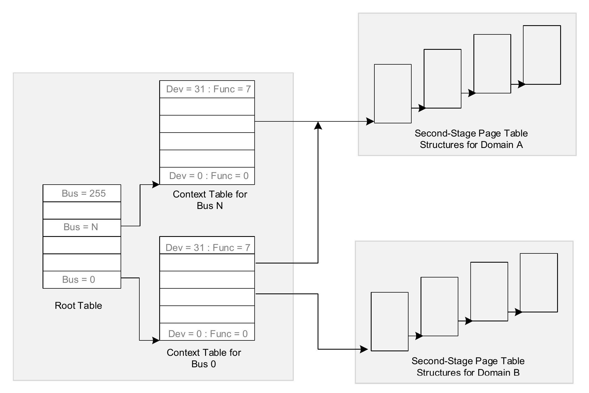
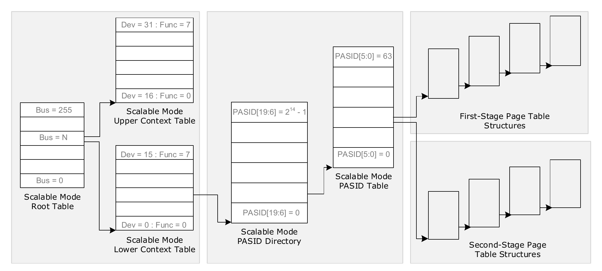
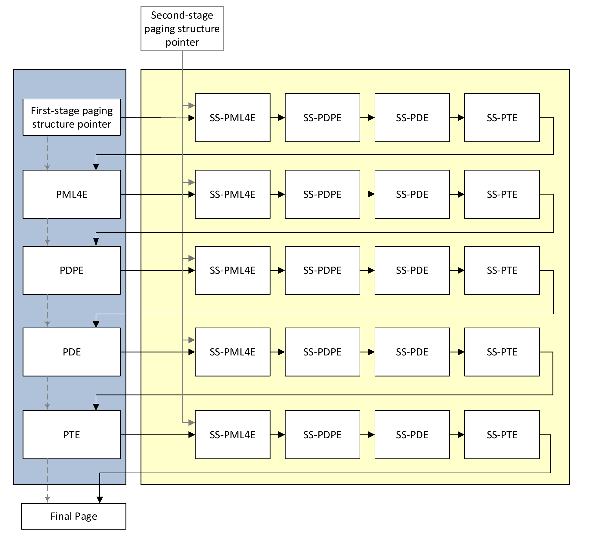

## IO Virtualization

### Intel VT-d

- 概述

  - 设备直通的硬件技术给OS提供了以下能力
    - 灵活的设备分配
    - DMA重映射
    - 中断重映射
    - 直通设备的posted interrupt
    - 向OS报告DMA和中断的错误

  - 无虚拟化场景，DMA重映射的用处
    - os可以保护一段内存不受恶意设备的访问
    - 32位兼容：32位PCI设备访问4G以上地址空间可以免除bounce buffer
    - 不同设备之间DMA的隔离
    - 支持PASID时，可以给设备传虚拟地址，让直通到user space的设备交互更加高效和方便

- DMA重映射

  - DMA有两种：携带PASID（Process Address Space ID）和不带PASID的

  - IOMMU将DMA address space翻译成host physical address space，前者可能是以下几种之一

    - GPA
    - GVA
    - VA from host userspace
    - IOVA defined and managed by host software
    - GIOVA defined and managed by guest software

  - IOMMU的翻译之后，才会发生其他硬件处理

    - 比如和cpu cache交互保证coherency
    - 比如地址解码
    - 比如访存

  - 服务器平台可能会有多个IOMMU

    - 可以被软件设置成各自管理各自Root Complex下挂载的设备
    - 也可以设置成使用统一的地址翻译表

  - IOMMU相关寄存器在一个MMIO page中，page的位置需要BIOS通过ACPI告知kernel

  - IOMMU页表结构

    - 四或五级页表，48bit/57bit，跟正常页表一样

    - 支持2M或1G大页，在Capability寄存器中报告

    - legacy mode

      

    - scalable mode（with optional PASID）

      

    - 通过BDF号查找到context entry后，可能涉及first-stage、second-stage两阶段地址转换（有无PASID均可）

      - legacy mode：只有second stage

      - scalable mode：可能有first stage，也可以first、second串联成两阶段转换

        - 如果有PASID，context entry指向PASID table，PASID table entry指向first/second stage tables（如上图）

        - 两阶段地址转换可以应用在虚拟化场景下

          - guest构造first stage table，里边是GVA（或者GIOVA）到GPA的映射

          - host（VMM）构造second tage table，里边是GPA到HPA的映射

          - 设备访存时，在经过first stage table的每一级页表，都要先经过second stage table，如下图

            

  - 地址转换的cache的几种类型

    - context entry
    - PASID table entry
    - IOTLB：first-stage/second-stage/nested
    - paging structure

  - Device-TLB

    - 设备可以持有自己的TLB，由Root Complex发送给设备
    - 设备可以将访存地址标记为“已转换”，从而跳过IOMMU

### Refs

- Intel VT-d Documentation - Intel Virtualization Technology for Direct I/O

